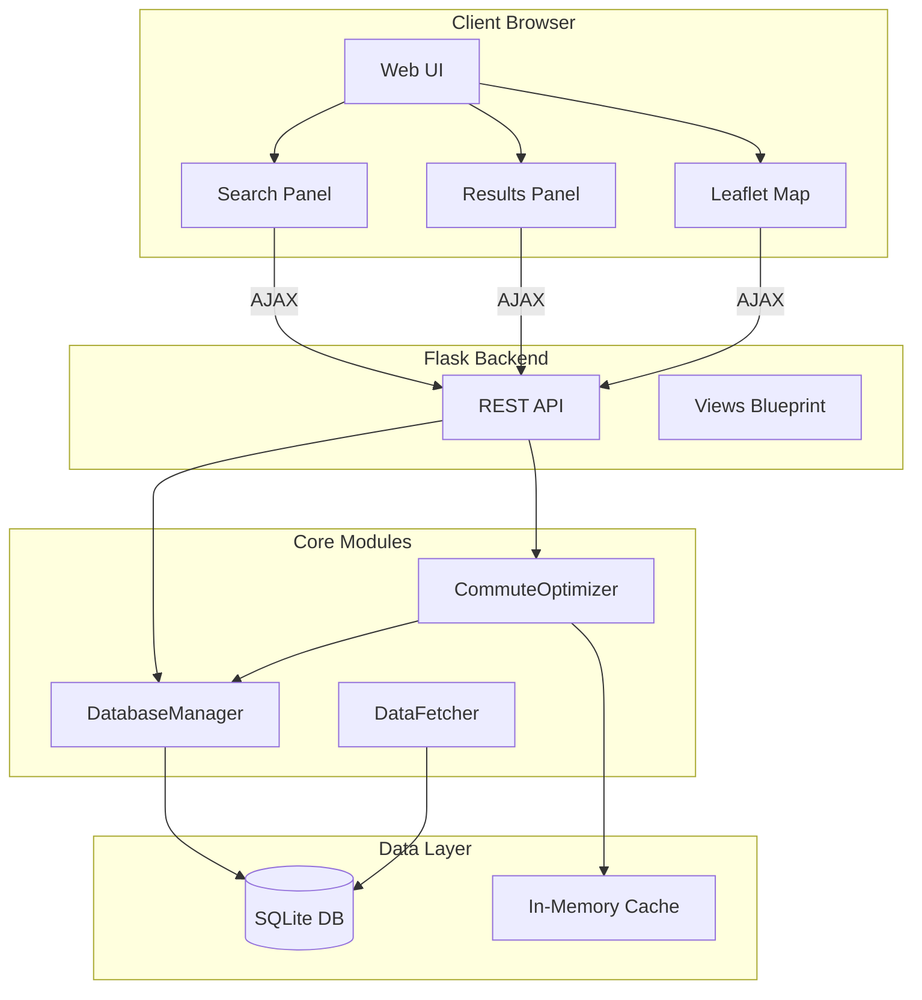
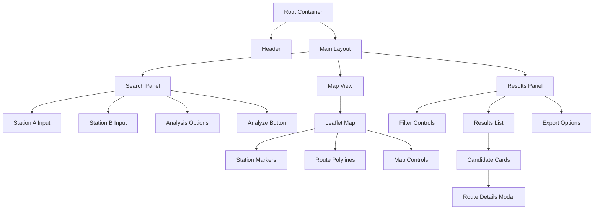
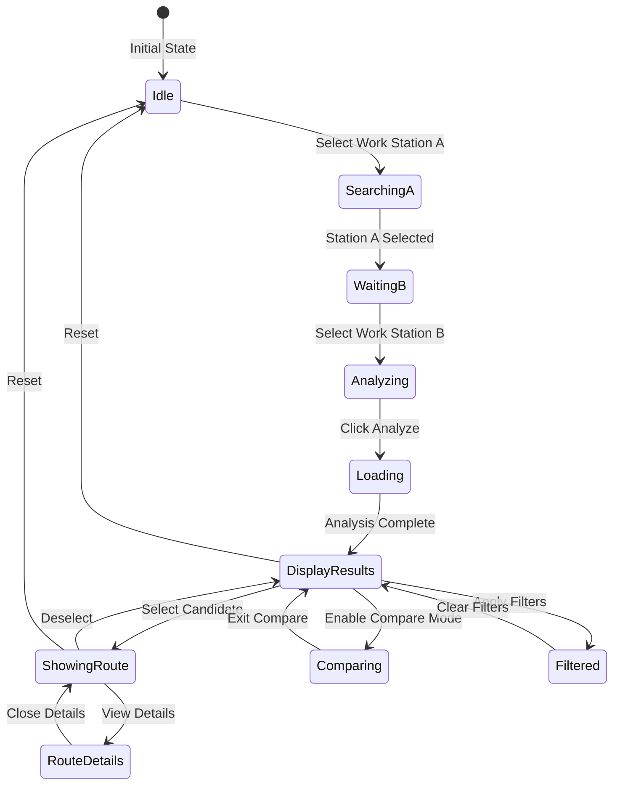
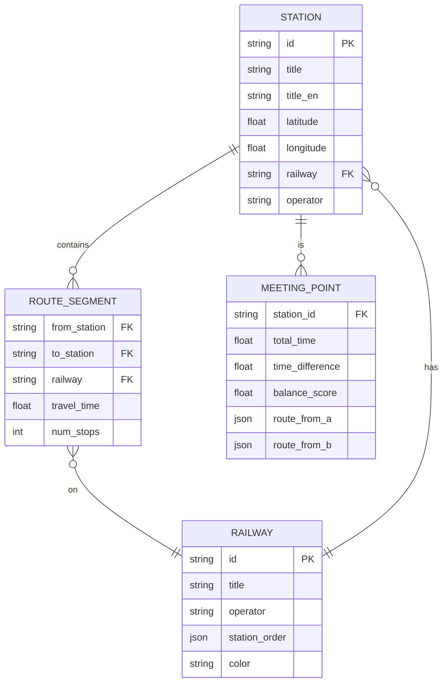
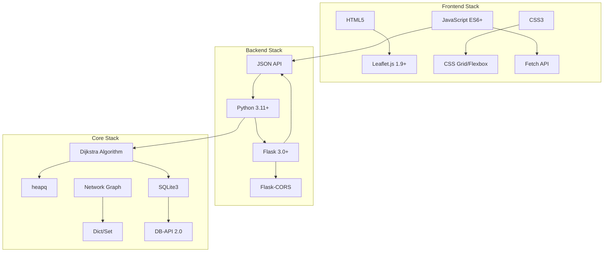

# Train Commute Optimizer - Architecture Diagram

## System Architecture



## Data Flow - Station Analysis

```mermaid
sequenceDiagram
    participant U as User
    participant UI as Web UI
    participant API as Flask API
    participant OPT as CommuteOptimizer
    participant DB as Database
    
    U->>UI: Enter Work Stations A & B
    UI->>API: POST /api/analyze
    API->>OPT: find_optimal_stations()
    OPT->>DB: Load network graph
    DB-->>OPT: Stations & Railways
    OPT->>OPT: Run Dijkstra's algorithm
    OPT->>OPT: Find common stations
    OPT->>OPT: Calculate balance scores
    OPT-->>API: Candidate stations + routes
    API-->>UI: JSON response
    UI->>UI: Render results panel
    UI->>UI: Draw routes on map
    UI-->>U: Display results
```

## Component Interaction

```mermaid
graph LR
    subgraph Frontend
        A[Search Input] --> B[API Client]
        C[Map Component] --> B
        D[Results List] --> B
    end
    
    subgraph API Layer
        B --> E[/api/stations/search]
        B --> F[/api/analyze]
        B --> G[/api/stations/all]
    end
    
    subgraph Business Logic
        E --> H[Station Search]
        F --> I[Route Analysis]
        G --> J[Station Listing]
    end
    
    subgraph Data Access
        H --> K[Network Graph]
        I --> K
        J --> K
        K --> L[(SQLite)]
    end
```

## UI Component Structure



## Route Visualization States



## Data Model - Key Entities



## Technology Stack



## Deployment Architecture

```mermaid
graph TB
    subgraph Production
        NGINX[Nginx Reverse Proxy] --> GUNICORN[Gunicorn Workers]
        GUNICORN --> FLASK1[Flask Instance 1]
        GUNICORN --> FLASK2[Flask Instance 2]
        GUNICORN --> FLASK3[Flask Instance 3]
    end
    
    subgraph Application
        FLASK1 --> CACHE[Redis Cache]
        FLASK2 --> CACHE
        FLASK3 --> CACHE
        CACHE --> DB[(PostgreSQL)]
    end
    
    subgraph Static Assets
        NGINX --> CDN[CDN for JS/CSS]
        CDN --> ASSETS[Static Files]
    end
    
    CLIENT[Clients] --> NGINX